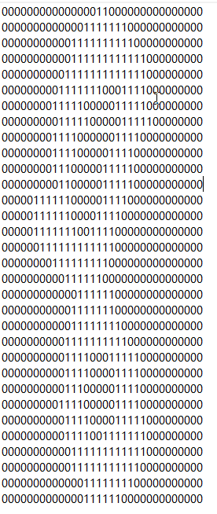

# written_digits-

# Source code description

本代码用深度学习方式搭建训练神经网络，训练手写数字识别项目。
## Requirement:

```
Python 3.7 
Pytorch 1.11.0
numpy 1.17.3
```


## Input format:数据集输入样式：

<p align="center">
  
</p>


## Run the code:

```
python train.py
```
- To train/test your own data: modify the command with your file path and run.
